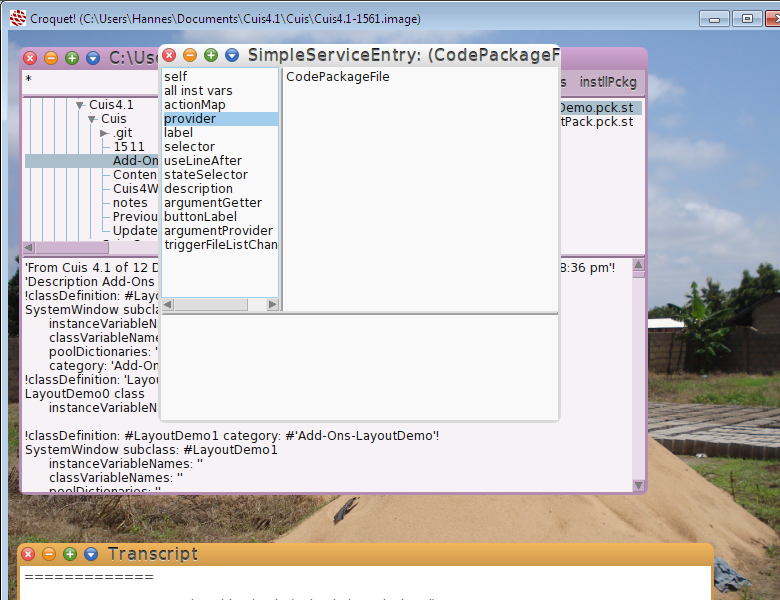

How to analyse a Morphic GUI
-----------------------------

The following is an illustration how any Morphic GUI may be "deconstructed" to find out what its parts are and how they operate on model classes.

Let's assume we want to find out which method the 'Install Package' button in the FileList window calls.

The middle mouse button on the FileList window activates the halos.

Repeated clicks with the middle mouse button on the *install button* brings up the **halos** for the *install button*. The *halos* are the colored dots. They serve as menus to access properties of the morphs.

The model which the InstallButton operates on

Finally the method which the install button calls.

### Conclusion ###
With the method shown any Morphic GUI may be analysed in terms of GUI widgets used and models on which these widgets operate on.
