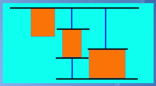

# Cuis Layouts and their Calculation
-----------------------------------

Cuis uses a Layout strategy which is different from many Smalltalks.  It is fairly simple to use once one understands the basics.

LayoutMorph's arrange submorphs as either a horizontal Row or a vertical Column.

Along this Major or Layout Axis, submorphs may be attracted toward one side (0.0) or the other (1.0) or anywhere in between.  This is the LayoutMorph's axisEdgeWeight.

If a Row, one can specify this weight symbolically as
  { #rowLeft (0.0), #center (0.5), #rowRight (1.0)}

If a Column, one can specify the weight symbolically as:
  { #columnTop (0.0), #center (0.5), #columnBottom (1.0) }

A LayoutMorph may also have a Morph Separation specified: x@y.

A LayoutMorph does its job by setting the morphPosition and morphExtent of its direct submorphs.

Each submorph of a LayoutMorph may have an optional LayoutSpec which the submorph uses to indicate how it wants to be arranged.

Options include treating Morph's width and height as fixed or proportional to the LayoutMorph's extent.

A LayoutSpec may also indicate a weighting perpendicular to the Layout Axis.   This is the LayoutSpec's offAxisEdgeWeight.

The Layout Axis of a Morph depends on the containing LayoutMorph being a Row or a Column.  Note that a LayoutMorph's axis can be changed by sending it the message #beRow or #beColumn.

Again, symbols may be used for common offAxis positions: { #leftOrTop (0.0), #center (0.5), #rightOrBottom (1.0) }

Let us see how this works in practice.

Here is a cyan LayoutMorph which contains three BorderedRectMorphs.  The default is for the LayoutMorph to be a row, the axisEdgeWeight to be 0.0, and the Separation to be 0.


Setting a Separation of 20@10 shifts the Morphs apart and effectively creates an "inset" into the LayoutMorph where submorphs cannot reside.


The following uses lines to show the separation.  With the axisEdgeWeight of zero and the morphs not taking up all the room in the LayoutMorph, there is extra space on the right.


We can change this by adding LayoutSpecs to the submorphs with proportional widths which add up to more than 100%.


If we change the LayoutSpec proportionalWidths to add up to less than 100%, we regain some space.


OK. Let us change the axisEdgeWeight to 0.5 to center the submorphs on the Row axis.

 

To calculate where to place Morphs on the row, we have several things to do.

- [1] First, the LayoutMorph width must contain the minimum widths of its submorphs along with their separation.
- [2] Two cases for the sum of the proporional widths:
-  [a] If the sum is >= 1 (over 100%), we will have no extra space and must scale that space so that the proportions go as requested.
-  [b] If the sum is < 1 (under 100%), we hand out space in proportion to the requests and have a bit left over.  In this case, we multiply the left-over width by the axisEdgeWeight and add the x separation to find the left edge of the first morph.

In our example, the left-over space is multiplied by 0.5 to give half the left-over space before the first submorph to center the Row.  Again, this is after the first separation.


Let us see what happens when we give submorph LayoutSpecs different offAxisEdgeWeights.  Here the weights are (0.0), (0.5), and (1.0).


The calculations for the placement off of (perpendicular to) the layout axis are almost the same but there is only one Morph to consider at each off-axis position.

Note that the horizontal and vertical calculations for each morphPosition and morphExtent can be done independently.



So that is the basis of Layouts in Cuis. Flexible, but as simple as we can make it!

----------------------------------
# Layout Calculations
----------------------------------

While fairly simple to use, there are some subtleties to calculating actual layouts.

From the Morph's point of view, a Morph has a morphExtent and a minimumExtent.  The default minimumExtent (width@height) is ```1@1```.  Check #senders to see who overrides this.

The optional LayoutSpec adds options, but must respect the Morph's minimumExtent.  The actual minimum, however, depends on information from both the Morph and its LayoutSpec (if any).

The LayoutSpec can specify (x and y independent):
- [A] Use the Morph's (current) Width wnd Height  [proportionalW/H nil, fixedW/H nil]
- [B] Have a fixed Width and Height [proportionalW/H nil, fixedW/H numbers]
- [C] Have a Width/Height proportional to the amount of otherwise unused/unoccupied layout space
[proportionalW/H 0..1, fixedW/H nil (=> 0) or a number].

Note that a LayoutMorph overrides method minimumExtent to calculate the combined minimum layout extents of its direct submorphs.

The basic job for a LayoutMorph is to lay out its submorphs along an axis and assign each a morphPosition and a morphExtent.

It can calculate the x and y of the x@y positions independently.  The off-axis calculation is simpler and we can start with that.

First, a LayoutMorph has not only a morphExtent, but also a layoutBounds.  This is to allow LayoutMorphs to have, for example, a title and/or a border.  So the submorphs are actually constrained to fit within the LayoutMorph's layoutBounds.

Second, to fit submorphs must actually fit!  So the next bit of business is to separately sum up the minimum or fixed widths and heights of submorphs along with the morph Separation, and make sure the containing LayoutMorph's morphExtent is large enough to hold the minimums.

Third, if there is extra room in either direction above the minimum, it may be put to use by proportionally based on layoutSpec's.  Note that for the major layout axis, the desired proportions my add up to over 100% of space, which requires scaling.  More on this below.  For now, we will just note that for off axis calculations, there is only a single morph, so its propostional desire can be used directly.

So, take the off-axis amount left over.  Let's assume a Row morph with a proportional height layout submorph in this example.  This "extra" height times the proportion (0..1) gives the desired height the morph wants.  The desired height must be at least the required height.  Take the max.

OK, there may still be unused height left over.  This is where the offAxisEdgeWeight comes in.

To find out the top Y position of the submorph, Start with the layoutBounds Y, add the separation, and multiply the left-over by the offAxisEdgeWeight to shift the submorph down as required (0->top .. 1->bottom).

The actual height of the morph we calculated above, so now we have the off-axis calculations of top Y and height.

So much for the easy part.

The more interesting part has has to do with calculations along the the layout axis.

For the most part, we just sum submorph measures along the layout axis.

There are two easy cases, so let's note those first.

- [1] No proportional submorph widths.  Just fixed calculations.  First X is layoutBounds X plus X Separation plus axisEdgeWeight times left-over.  Each width fixed.  Next X is first X plus Width plus X Separation, and so on for each submorph.

- [2] Proportional widths, but after distributing proportionally, each width is greater than the minimum width.  Basically the same as case [1].

- [3] Proportional widths but one or more are less than the minimum required.  This means that we are lacking and must take some proportionally from each proportion.  But of course this changes the amount available to allocate.  But then we still could be over.  Hmm..  Sounds like an iterative approximation algorithm.  Can we do better?

For harder case [3], how good is good enough?  How about a good first approimation?

The observation is that all submorphs fit and there is no left-over after proportioning. Also, there is a balance point above which the minimum width/height is satisfied by proportional layout. ```alloc * proportion * factor = min``` implies ```allocBalance = min / (proportion * factor)```.  If we take the max of the allocBalance over the proportional morphs, this gives the smallest width/height allocation where things fit.  If we then measure the proportions at this point, we can use ```min{Height/Width} + (toAlloc * thisProp)``` below the allocation balance point and the desired proportions above the balance point.

Details matter.

With so many width/height/extent variants, it is easy to become confused.  The basic strategy is that for a LayoutSpec, there is a  minimumSpec{Height/Width/Extent}.  For a Morph, there is a minimumExtent.  ```Morph>>minimumExtent``` is the method to override for special behavior.  The Morph methods which combine information from a Morph and its LayoutSpec are minimumLayout{Width/Height/Extent}.  These methods honor information from both the Morph>>minimumExtent and the optional LayoutSpec.

